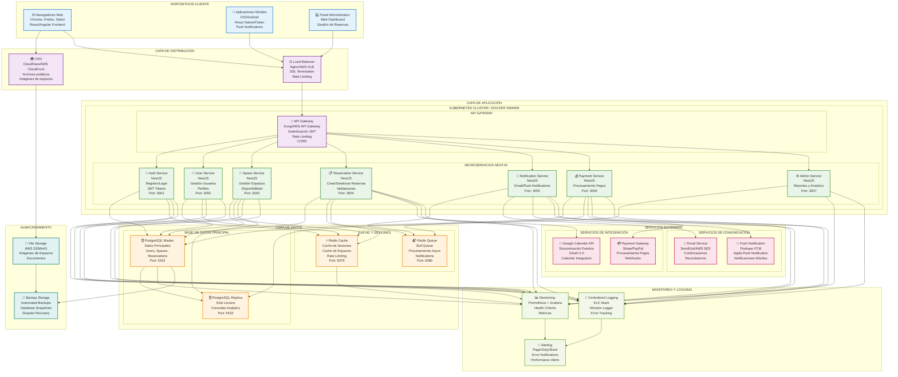

```mermaid
graph TB
    %% Client Devices
    subgraph "DISPOSITIVOS CLIENTE"
        WEB_BROWSER[🌐 Navegadores Web<br/>Chrome, Firefox, Safari<br/>React/Angular Frontend]
        MOBILE_APP[📱 Aplicaciones Móviles<br/>iOS/Android<br/>React Native/Flutter<br/>Push Notifications]
        ADMIN_PANEL[💻 Panel Administrativo<br/>Web Dashboard<br/>Gestión de Reservas]
    end

    %% Load Balancer / CDN
    subgraph "CAPA DE DISTRIBUCIÓN"
        CDN[🌍 CDN<br/>CloudFlare/AWS CloudFront<br/>Archivos estáticos<br/>Imágenes de espacios]
        LOAD_BALANCER[⚖️ Load Balancer<br/>Nginx/AWS ALB<br/>SSL Termination<br/>Rate Limiting]
    end

    %% Application Layer
    subgraph "CAPA DE APLICACIÓN"
        direction TB
        subgraph "KUBERNETES CLUSTER / DOCKER SWARM"
            direction LR

            subgraph "API GATEWAY"
                API_GATEWAY[🚪 API Gateway<br/>Kong/AWS API Gateway<br/>Autenticación JWT<br/>Rate Limiting<br/>CORS]
            end

            subgraph "MICROSERVICIOS NESTJS"
                AUTH_SERVICE[🔐 Auth Service<br/>NestJS<br/>Registro/Login<br/>JWT Tokens<br/>Port: 3001]

                USER_SERVICE[👥 User Service<br/>NestJS<br/>Gestión Usuarios<br/>Perfiles<br/>Port: 3002]

                SPACE_SERVICE[🏢 Space Service<br/>NestJS<br/>Gestión Espacios<br/>Disponibilidad<br/>Port: 3003]

                RESERVATION_SERVICE[📋 Reservation Service<br/>NestJS<br/>Crear/Gestionar Reservas<br/>Validaciones<br/>Port: 3004]

                NOTIFICATION_SERVICE[🔔 Notification Service<br/>NestJS<br/>Email/Push Notifications<br/>Port: 3005]

                PAYMENT_SERVICE[💰 Payment Service<br/>NestJS<br/>Procesamiento Pagos<br/>Port: 3006]

                ADMIN_SERVICE[⚙️ Admin Service<br/>NestJS<br/>Reportes y Analytics<br/>Port: 3007]
            end
        end
    end

    %% Database Layer
    subgraph "CAPA DE DATOS"
        direction TB

        subgraph "BASE DE DATOS PRINCIPAL"
            POSTGRES_MASTER[🗄️ PostgreSQL Master<br/>Datos Principales<br/>Users, Spaces, Reservations<br/>Port: 5432]
            POSTGRES_REPLICA[🗄️ PostgreSQL Replica<br/>Solo Lectura<br/>Consultas Analytics<br/>Port: 5433]
        end

        subgraph "CACHE Y SESIONES"
            REDIS_CACHE[⚡ Redis Cache<br/>Cache de Sesiones<br/>Cache de Espacios<br/>Rate Limiting<br/>Port: 6379]
            REDIS_QUEUE[📬 Redis Queue<br/>Bull Queue<br/>Procesamiento Async<br/>Notifications<br/>Port: 6380]
        end
    end

    %% External Services
    subgraph "SERVICIOS EXTERNOS"
        direction TB

        subgraph "SERVICIOS DE COMUNICACIÓN"
            EMAIL_SERVICE[📧 Email Service<br/>SendGrid/AWS SES<br/>Confirmaciones<br/>Recordatorios]

            PUSH_SERVICE[📱 Push Notification<br/>Firebase FCM<br/>Apple Push Notification<br/>Notificaciones Móviles]
        end

        subgraph "SERVICIOS DE INTEGRACIÓN"
            PAYMENT_GATEWAY[💳 Payment Gateway<br/>Stripe/PayPal<br/>Procesamiento Pagos<br/>Webhooks]

            GOOGLE_CALENDAR[📅 Google Calendar API<br/>Sincronización Eventos<br/>OAuth 2.0<br/>Calendar Integration]
        end
    end

    %% Monitoring & Logging
    subgraph "MONITOREO Y LOGGING"
        direction LR
        MONITORING[📊 Monitoring<br/>Prometheus + Grafana<br/>Health Checks<br/>Métricas]

        LOGGING[📝 Centralized Logging<br/>ELK Stack<br/>Winston Logger<br/>Error Tracking]

        ALERTING[🚨 Alerting<br/>PagerDuty/Slack<br/>Error Notifications<br/>Performance Alerts]
    end

    %% Storage
    subgraph "ALMACENAMIENTO"
        FILE_STORAGE[📁 File Storage<br/>AWS S3/MinIO<br/>Imágenes de Espacios<br/>Documentos]

        BACKUP_STORAGE[💾 Backup Storage<br/>Automated Backups<br/>Database Snapshots<br/>Disaster Recovery]
    end

    %% Connections - Client to Load Balancer
    WEB_BROWSER --> CDN
    WEB_BROWSER --> LOAD_BALANCER
    MOBILE_APP --> LOAD_BALANCER
    ADMIN_PANEL --> LOAD_BALANCER

    %% Load Balancer to API Gateway
    LOAD_BALANCER --> API_GATEWAY
    CDN --> FILE_STORAGE

    %% API Gateway to Services
    API_GATEWAY --> AUTH_SERVICE
    API_GATEWAY --> USER_SERVICE
    API_GATEWAY --> SPACE_SERVICE
    API_GATEWAY --> RESERVATION_SERVICE
    API_GATEWAY --> NOTIFICATION_SERVICE
    API_GATEWAY --> PAYMENT_SERVICE
    API_GATEWAY --> ADMIN_SERVICE

    %% Services to Database
    AUTH_SERVICE --> POSTGRES_MASTER
    USER_SERVICE --> POSTGRES_MASTER
    SPACE_SERVICE --> POSTGRES_MASTER
    RESERVATION_SERVICE --> POSTGRES_MASTER
    PAYMENT_SERVICE --> POSTGRES_MASTER

    %% Read operations to replica
    ADMIN_SERVICE --> POSTGRES_REPLICA
    SPACE_SERVICE --> POSTGRES_REPLICA

    %% Services to Cache
    AUTH_SERVICE --> REDIS_CACHE
    USER_SERVICE --> REDIS_CACHE
    SPACE_SERVICE --> REDIS_CACHE
    RESERVATION_SERVICE --> REDIS_CACHE

    %% Services to Queue
    NOTIFICATION_SERVICE --> REDIS_QUEUE
    PAYMENT_SERVICE --> REDIS_QUEUE
    RESERVATION_SERVICE --> REDIS_QUEUE

    %% Database Replication
    POSTGRES_MASTER --> POSTGRES_REPLICA

    %% External Service Connections
    NOTIFICATION_SERVICE --> EMAIL_SERVICE
    NOTIFICATION_SERVICE --> PUSH_SERVICE
    PAYMENT_SERVICE --> PAYMENT_GATEWAY
    RESERVATION_SERVICE --> GOOGLE_CALENDAR

    %% Monitoring Connections
    AUTH_SERVICE --> MONITORING
    USER_SERVICE --> MONITORING
    SPACE_SERVICE --> MONITORING
    RESERVATION_SERVICE --> MONITORING
    NOTIFICATION_SERVICE --> MONITORING
    PAYMENT_SERVICE --> MONITORING
    ADMIN_SERVICE --> MONITORING
    POSTGRES_MASTER --> MONITORING
    REDIS_CACHE --> MONITORING

    %% Logging Connections
    AUTH_SERVICE --> LOGGING
    USER_SERVICE --> LOGGING
    SPACE_SERVICE --> LOGGING
    RESERVATION_SERVICE --> LOGGING
    NOTIFICATION_SERVICE --> LOGGING
    PAYMENT_SERVICE --> LOGGING
    ADMIN_SERVICE --> LOGGING

    %% Backup Connections
    POSTGRES_MASTER --> BACKUP_STORAGE
    FILE_STORAGE --> BACKUP_STORAGE

    %% Alerting
    MONITORING --> ALERTING
    LOGGING --> ALERTING

    %% Styling
    classDef client fill:#e3f2fd,stroke:#1976d2,stroke-width:2px
    classDef infrastructure fill:#f3e5f5,stroke:#7b1fa2,stroke-width:2px
    classDef application fill:#e8f5e8,stroke:#388e3c,stroke-width:2px
    classDef database fill:#fff3e0,stroke:#f57c00,stroke-width:2px
    classDef external fill:#fce4ec,stroke:#c2185b,stroke-width:2px
    classDef monitoring fill:#f1f8e9,stroke:#689f38,stroke-width:2px
    classDef storage fill:#e0f2f1,stroke:#00796b,stroke-width:2px

    class WEB_BROWSER,MOBILE_APP,ADMIN_PANEL client
    class CDN,LOAD_BALANCER,API_GATEWAY infrastructure
    class AUTH_SERVICE,USER_SERVICE,SPACE_SERVICE,RESERVATION_SERVICE,NOTIFICATION_SERVICE,PAYMENT_SERVICE,ADMIN_SERVICE application
    class POSTGRES_MASTER,POSTGRES_REPLICA,REDIS_CACHE,REDIS_QUEUE database
    class EMAIL_SERVICE,PUSH_SERVICE,PAYMENT_GATEWAY,GOOGLE_CALENDAR external
    class MONITORING,LOGGING,ALERTING monitoring
    class FILE_STORAGE,BACKUP_STORAGE storage
```