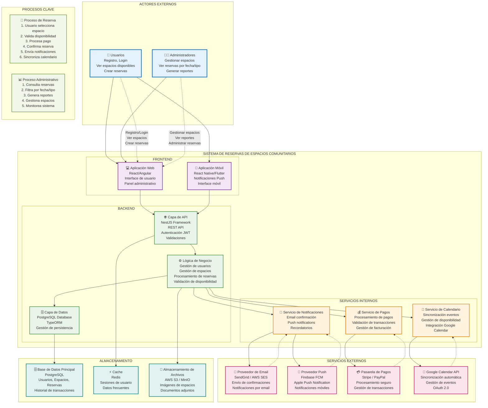

```mermaid
graph TB
    %% External Users and Systems
    subgraph "ACTORES EXTERNOS"
        USER[👤 Usuarios<br/>Registro, Login<br/>Ver espacios disponibles<br/>Crear reservas]
        ADMIN[👨‍💼 Administradores<br/>Gestionar espacios<br/>Ver reservas por fecha/tipo<br/>Generar reportes]
    end
    
    %% Main System
    subgraph "SISTEMA DE RESERVAS DE ESPACIOS COMUNITARIOS"
        direction TB
        
        subgraph "FRONTEND"
            WEB_APP[💻 Aplicación Web<br/>React/Angular<br/>Interface de usuario<br/>Panel administrativo]
            MOBILE_APP[📱 Aplicación Móvil<br/>React Native/Flutter<br/>Notificaciones Push<br/>Interface móvil]
        end
        
        subgraph "BACKEND"
            API_LAYER[🌐 Capa de API<br/>NestJS Framework<br/>REST API<br/>Autenticación JWT<br/>Validaciones]
            
            BUSINESS_LOGIC[⚙️ Lógica de Negocio<br/>Gestión de usuarios<br/>Gestión de espacios<br/>Procesamiento de reservas<br/>Validación de disponibilidad]
            
            DATA_LAYER[🗄️ Capa de Datos<br/>PostgreSQL Database<br/>TypeORM<br/>Gestión de persistencia]
        end
        
        subgraph "SERVICIOS INTERNOS"
            NOTIFICATION_SVC[🔔 Servicio de Notificaciones<br/>Email confirmación<br/>Push notifications<br/>Recordatorios]
            
            PAYMENT_SVC[💰 Servicio de Pagos<br/>Procesamiento de pagos<br/>Validación de transacciones<br/>Gestión de facturación]
            
            CALENDAR_SVC[📅 Servicio de Calendario<br/>Sincronización eventos<br/>Gestión de disponibilidad<br/>Integración Google Calendar]
        end
    end
    
    %% External Services
    subgraph "SERVICIOS EXTERNOS"
        EMAIL_PROVIDER[📧 Proveedor de Email<br/>SendGrid / AWS SES<br/>Envío de confirmaciones<br/>Notificaciones por email]
        
        PUSH_PROVIDER[📱 Proveedor Push<br/>Firebase FCM<br/>Apple Push Notification<br/>Notificaciones móviles]
        
        PAYMENT_GATEWAY[💳 Pasarela de Pagos<br/>Stripe / PayPal<br/>Procesamiento seguro<br/>Gestión de transacciones]
        
        GOOGLE_CALENDAR[📅 Google Calendar API<br/>Sincronización automática<br/>Gestión de eventos<br/>OAuth 2.0]
    end
    
    %% Data Storage
    subgraph "ALMACENAMIENTO"
        DATABASE[🗄️ Base de Datos Principal<br/>PostgreSQL<br/>Usuarios, Espacios, Reservas<br/>Historial de transacciones]
        
        CACHE[⚡ Cache<br/>Redis<br/>Sesiones de usuario<br/>Datos frecuentes]
        
        FILE_STORAGE[📁 Almacenamiento de Archivos<br/>AWS S3 / MinIO<br/>Imágenes de espacios<br/>Documentos adjuntos]
    end
    
    %% User Interactions
    USER --> WEB_APP
    USER --> MOBILE_APP
    ADMIN --> WEB_APP
    
    %% Frontend to Backend
    WEB_APP --> API_LAYER
    MOBILE_APP --> API_LAYER
    
    %% Backend Internal Flow
    API_LAYER --> BUSINESS_LOGIC
    BUSINESS_LOGIC --> DATA_LAYER
    BUSINESS_LOGIC --> NOTIFICATION_SVC
    BUSINESS_LOGIC --> PAYMENT_SVC
    BUSINESS_LOGIC --> CALENDAR_SVC
    
    %% Data Layer Connections
    DATA_LAYER --> DATABASE
    API_LAYER --> CACHE
    BUSINESS_LOGIC --> FILE_STORAGE
    
    %% Internal Services to External Services
    NOTIFICATION_SVC --> EMAIL_PROVIDER
    NOTIFICATION_SVC --> PUSH_PROVIDER
    PAYMENT_SVC --> PAYMENT_GATEWAY
    CALENDAR_SVC --> GOOGLE_CALENDAR
    
    %% External Services Feedback
    EMAIL_PROVIDER -.-> NOTIFICATION_SVC
    PUSH_PROVIDER -.-> NOTIFICATION_SVC
    PAYMENT_GATEWAY -.-> PAYMENT_SVC
    GOOGLE_CALENDAR -.-> CALENDAR_SVC
    
    %% Data Flow Labels
    USER -.->|"Registro/Login<br/>Ver espacios<br/>Crear reservas"| WEB_APP
    ADMIN -.->|"Gestionar espacios<br/>Ver reportes<br/>Administrar reservas"| WEB_APP
    
    %% Key Processes
    subgraph "PROCESOS CLAVE"
        PROCESS1[🔄 Proceso de Reserva<br/>1. Usuario selecciona espacio<br/>2. Valida disponibilidad<br/>3. Procesa pago<br/>4. Confirma reserva<br/>5. Envía notificaciones<br/>6. Sincroniza calendario]
        
        PROCESS2[📊 Proceso Administrativo<br/>1. Consulta reservas<br/>2. Filtra por fecha/tipo<br/>3. Genera reportes<br/>4. Gestiona espacios<br/>5. Monitorea sistema]
    end
    
    %% Styling
    classDef user fill:#e3f2fd,stroke:#1976d2,stroke-width:3px
    classDef frontend fill:#f3e5f5,stroke:#7b1fa2,stroke-width:2px
    classDef backend fill:#e8f5e8,stroke:#388e3c,stroke-width:2px
    classDef service fill:#fff3e0,stroke:#f57c00,stroke-width:2px
    classDef external fill:#fce4ec,stroke:#c2185b,stroke-width:2px
    classDef storage fill:#e0f2f1,stroke:#00796b,stroke-width:2px
    classDef process fill:#f1f8e9,stroke:#689f38,stroke-width:2px
    
    class USER,ADMIN user
    class WEB_APP,MOBILE_APP frontend
    class API_LAYER,BUSINESS_LOGIC,DATA_LAYER backend
    class NOTIFICATION_SVC,PAYMENT_SVC,CALENDAR_SVC service
    class EMAIL_PROVIDER,PUSH_PROVIDER,PAYMENT_GATEWAY,GOOGLE_CALENDAR external
    class DATABASE,CACHE,FILE_STORAGE storage
    class PROCESS1,PROCESS2 process
```