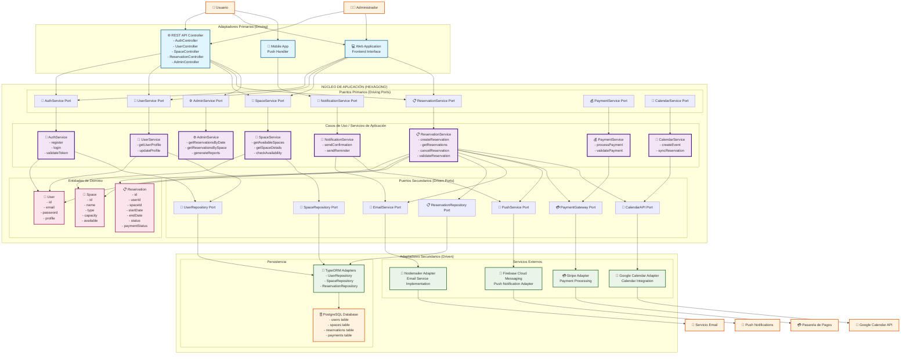

```mermaid
graph TB
    %% External Actors
    USER[👤 Usuario]
    ADMIN[👨‍💼 Administrador]
    EMAIL_SERVICE[📧 Servicio Email]
    PUSH_SERVICE[📱 Push Notifications]
    PAYMENT_GATEWAY[💳 Pasarela de Pagos]
    GOOGLE_CALENDAR[📅 Google Calendar API]

    %% Primary Adapters (Driving)
    subgraph "Adaptadores Primarios (Driving)"
        REST_API[🌐 REST API Controller<br/>- AuthController<br/>- UserController<br/>- SpaceController<br/>- ReservationController<br/>- AdminController]
        WEB_APP[💻 Web Application<br/>Frontend Interface]
        MOBILE_APP[📱 Mobile App<br/>Push Handler]
    end

    %% Application Core (Hexagon)
    subgraph "NÚCLEO DE APLICACIÓN (HEXÁGONO)"
        subgraph "Puertos Primarios (Driving Ports)"
            AUTH_PORT[🔐 AuthService Port]
            USER_PORT[👥 UserService Port]
            SPACE_PORT[🏢 SpaceService Port]
            RESERVATION_PORT[📋 ReservationService Port]
            ADMIN_PORT[⚙️ AdminService Port]
            NOTIFICATION_PORT[🔔 NotificationService Port]
            PAYMENT_PORT[💰 PaymentService Port]
            CALENDAR_PORT[📆 CalendarService Port]
        end

        subgraph "Casos de Uso / Servicios de Aplicación"
            AUTH_SERVICE[🔐 AuthService<br/>- register<br/>- login<br/>- validateToken]
            USER_SERVICE[👥 UserService<br/>- getUserProfile<br/>- updateProfile]
            SPACE_SERVICE[🏢 SpaceService<br/>- getAvailableSpaces<br/>- getSpaceDetails<br/>- checkAvailability]
            RESERVATION_SERVICE[📋 ReservationService<br/>- createReservation<br/>- getReservations<br/>- cancelReservation<br/>- validateReservation]
            ADMIN_SERVICE[⚙️ AdminService<br/>- getReservationsByDate<br/>- getReservationsBySpace<br/>- generateReports]
            NOTIFICATION_SERVICE[🔔 NotificationService<br/>- sendConfirmation<br/>- sendReminder]
            PAYMENT_SERVICE[💰 PaymentService<br/>- processPayment<br/>- validatePayment]
            CALENDAR_SERVICE[📆 CalendarService<br/>- createEvent<br/>- syncReservation]
        end

        subgraph "Entidades de Dominio"
            USER_ENTITY[👤 User<br/>- id<br/>- email<br/>- password<br/>- profile]
            SPACE_ENTITY[🏢 Space<br/>- id<br/>- name<br/>- type<br/>- capacity<br/>- available]
            RESERVATION_ENTITY[📋 Reservation<br/>- id<br/>- userId<br/>- spaceId<br/>- startDate<br/>- endDate<br/>- status<br/>- paymentStatus]
        end

        subgraph "Puertos Secundarios (Driven Ports)"
            USER_REPO_PORT[👥 UserRepository Port]
            SPACE_REPO_PORT[🏢 SpaceRepository Port]
            RESERVATION_REPO_PORT[📋 ReservationRepository Port]
            EMAIL_PORT[📧 EmailService Port]
            PUSH_PORT[📱 PushService Port]
            PAYMENT_GATEWAY_PORT[💳 PaymentGateway Port]
            CALENDAR_API_PORT[📅 CalendarAPI Port]
        end
    end

    %% Secondary Adapters (Driven)
    subgraph "Adaptadores Secundarios (Driven)"
        subgraph "Persistencia"
            POSTGRES_DB[🗄️ PostgreSQL Database<br/>- users table<br/>- spaces table<br/>- reservations table<br/>- payments table]
            TYPEORM[🔗 TypeORM Adapters<br/>- UserRepository<br/>- SpaceRepository<br/>- ReservationRepository]
        end

        subgraph "Servicios Externos"
            NODEMAILER[📧 Nodemailer Adapter<br/>Email Service Implementation]
            FCM_ADAPTER[📱 Firebase Cloud Messaging<br/>Push Notification Adapter]
            STRIPE_ADAPTER[💳 Stripe Adapter<br/>Payment Processing]
            GOOGLE_API_ADAPTER[📅 Google Calendar Adapter<br/>Calendar Integration]
        end
    end

    %% Connections - External to Primary Adapters
    USER --> REST_API
    USER --> WEB_APP
    USER --> MOBILE_APP
    ADMIN --> REST_API
    ADMIN --> WEB_APP

    %% Connections - Primary Adapters to Ports
    REST_API --> AUTH_PORT
    REST_API --> USER_PORT
    REST_API --> SPACE_PORT
    REST_API --> RESERVATION_PORT
    REST_API --> ADMIN_PORT
    WEB_APP --> AUTH_PORT
    WEB_APP --> USER_PORT
    WEB_APP --> SPACE_PORT
    WEB_APP --> RESERVATION_PORT
    MOBILE_APP --> NOTIFICATION_PORT

    %% Connections - Ports to Services
    AUTH_PORT --> AUTH_SERVICE
    USER_PORT --> USER_SERVICE
    SPACE_PORT --> SPACE_SERVICE
    RESERVATION_PORT --> RESERVATION_SERVICE
    ADMIN_PORT --> ADMIN_SERVICE
    NOTIFICATION_PORT --> NOTIFICATION_SERVICE
    PAYMENT_PORT --> PAYMENT_SERVICE
    CALENDAR_PORT --> CALENDAR_SERVICE

    %% Connections - Services to Entities
    AUTH_SERVICE --> USER_ENTITY
    USER_SERVICE --> USER_ENTITY
    SPACE_SERVICE --> SPACE_ENTITY
    RESERVATION_SERVICE --> RESERVATION_ENTITY
    RESERVATION_SERVICE --> SPACE_ENTITY
    RESERVATION_SERVICE --> USER_ENTITY

    %% Connections - Services to Secondary Ports
    AUTH_SERVICE --> USER_REPO_PORT
    USER_SERVICE --> USER_REPO_PORT
    SPACE_SERVICE --> SPACE_REPO_PORT
    RESERVATION_SERVICE --> RESERVATION_REPO_PORT
    RESERVATION_SERVICE --> EMAIL_PORT
    RESERVATION_SERVICE --> PUSH_PORT
    RESERVATION_SERVICE --> PAYMENT_GATEWAY_PORT
    RESERVATION_SERVICE --> CALENDAR_API_PORT
    NOTIFICATION_SERVICE --> EMAIL_PORT
    NOTIFICATION_SERVICE --> PUSH_PORT
    PAYMENT_SERVICE --> PAYMENT_GATEWAY_PORT
    CALENDAR_SERVICE --> CALENDAR_API_PORT

    %% Connections - Secondary Ports to Adapters
    USER_REPO_PORT --> TYPEORM
    SPACE_REPO_PORT --> TYPEORM
    RESERVATION_REPO_PORT --> TYPEORM
    EMAIL_PORT --> NODEMAILER
    PUSH_PORT --> FCM_ADAPTER
    PAYMENT_GATEWAY_PORT --> STRIPE_ADAPTER
    CALENDAR_API_PORT --> GOOGLE_API_ADAPTER

    %% Connections - Adapters to External Services
    TYPEORM --> POSTGRES_DB
    NODEMAILER --> EMAIL_SERVICE
    FCM_ADAPTER --> PUSH_SERVICE
    STRIPE_ADAPTER --> PAYMENT_GATEWAY
    GOOGLE_API_ADAPTER --> GOOGLE_CALENDAR

    %% Styling
    classDef primaryAdapter fill:#e1f5fe,stroke:#01579b,stroke-width:2px
    classDef core fill:#f3e5f5,stroke:#4a148c,stroke-width:3px
    classDef secondaryAdapter fill:#e8f5e8,stroke:#1b5e20,stroke-width:2px
    classDef external fill:#fff3e0,stroke:#e65100,stroke-width:2px
    classDef entity fill:#fce4ec,stroke:#880e4f,stroke-width:2px

    class REST_API,WEB_APP,MOBILE_APP primaryAdapter
    class AUTH_SERVICE,USER_SERVICE,SPACE_SERVICE,RESERVATION_SERVICE,ADMIN_SERVICE,NOTIFICATION_SERVICE,PAYMENT_SERVICE,CALENDAR_SERVICE core
    class TYPEORM,NODEMAILER,FCM_ADAPTER,STRIPE_ADAPTER,GOOGLE_API_ADAPTER secondaryAdapter
    class USER,ADMIN,EMAIL_SERVICE,PUSH_SERVICE,PAYMENT_GATEWAY,GOOGLE_CALENDAR,POSTGRES_DB external
    class USER_ENTITY,SPACE_ENTITY,RESERVATION_ENTITY entity
```